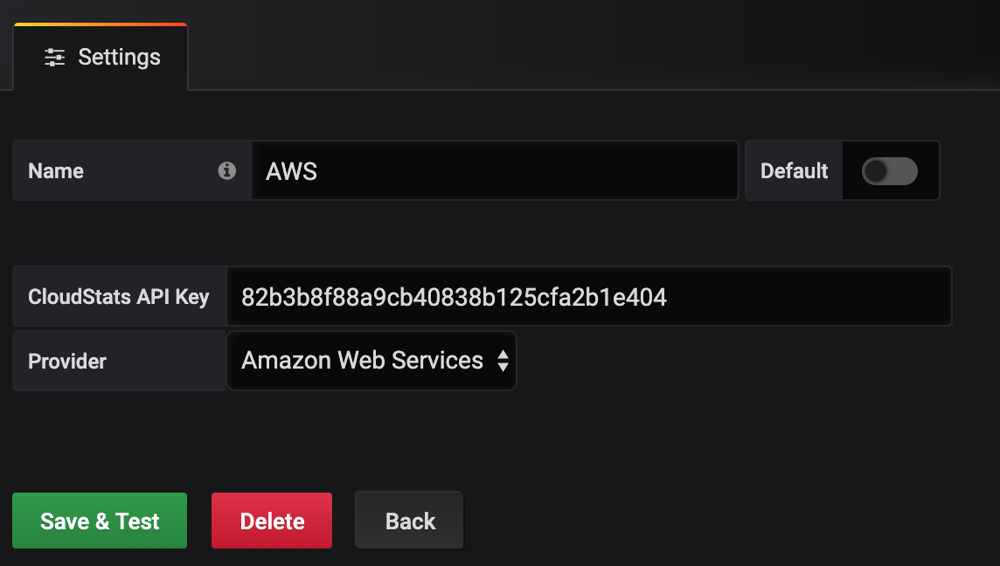
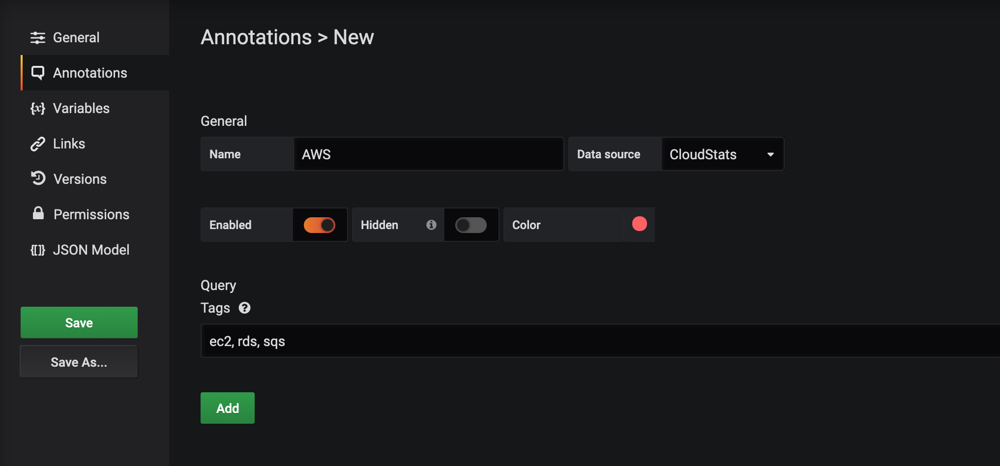
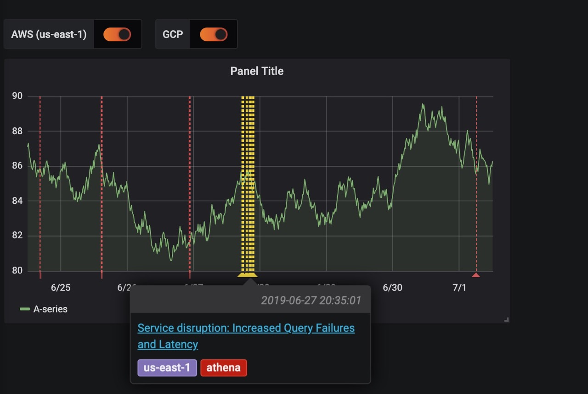

# CloudStats Datasource
CloudStats Datasource is Grafana annotations datasource to access cloud providers status inside dashboard.

## Cloud Providers
#### Data Centers
- [**Amazon Web Services**](https://aws.amazon.com/)  
  - *Filtering by services and regions*
- [**Google Cloud Platform**](https://cloud.google.com/)  
  - *Range annotations*
- [**Digital Ocean**](https://digitalocean.com/)
#### Docker registries
- [**Docker**](https://hub.docker.com/)
- [**Quay.io**](https://quay.io)
#### Messaging
- [**Slack**](https://slack.com)
#### Log Management
- [**Logz.io**](https://logz.io)
#### Version Control
- [**Github**](https://github.com)
#### Notifications Services
- [**Twilio**](https://twilio.com)
- [**Sendgrid**](https://sendgrid.com)
#### Networking
- [**Cloudflare**](https://cloudflare.com)
#### Billing
- [**Chargebee**](https://chargebee.com)

## Installing
### Installing from Grafana
Coming soon
### Installing from source
Download latest release or clone the repo to your Grafana server to plugins directory.  
#### OS package
Plugins directory on linux usually is `/var/lib/grafana/plugins`. Clone/download/soft link repository into it.  
For example cloning:
```
$ cd /var/lib/grafana/plugins
$ git clone https://github.com/cloudstats-app/grafana-cloudstats-datasource.git
$ systemctl restart grafana-server
```
#### Docker
In custom image download the plugin to plugins directory or mount it into container.  
Dockerfile example:
```
...
ADD --chown=grafana:grafana https://github.com/cloudstats-app/grafana-cloudstats-datasource/archive/master.zip /tmp/master.zip
RUN unzip /tmp/master.zip -d /tmp && \
    mkdir -p ${GF_PATHS_PLUGINS}/grafana-cloudstats-datasource && \
    cp -a /tmp/grafana-cloudstats-datasource-master/dist/ ${GF_PATHS_PLUGINS}/grafana-cloudstats-datasource/ && \
    rm -r /tmp/grafana-cloudstats-datasource-master /tmp/master.zip
...
```
Mount example:
```
$ git clone https://github.com/cloudstats-app/grafana-cloudstats-datasource.git /opt/grafana-cloudstats-datasource
$ docker run -d --name=grafana -p 3000:3000 -v /opt/grafana-cloudstats-datasource:/var/lib/grafana/plugins/grafana-cloudstats-datasource grafana/grafana
```

## Registration
Go to [cloudstats.app](https://cloudstats.app) and register to receive API key

## Configuring
### Adding datasource
In Grafana dashboard add new datasource and select CloudStats.  
Insert API key received by registration process and select desired cloud provider.  
- *If CloudStats used with multiple providers it's advised to add inside datasource name provider identifications*  


### Adding annotation
Once new datasource configured open desired dashboard setting, select `Annotations` and add new give the name to annotation.  
- *AWS stats allow filtering the incidents with tags. Tags can be service names like `ec2`, `rds` and regions like `us-east-1`, `eu-central-1`.*  
  

Once added cloud provider incidents will be shown on the graphs:  
